# 基于springboot的校园失物招领系统

---
### 👉作者QQ ：1556708905 微信：zheng0123Long (支持定制修改、部署调试、定制毕设)

### 👉接网站建设、小程序、H5、APP、各种系统等

---

#### 介绍

在校园生活中，失物与寻物的情况时常发生。为了更高效地解决校园内的失物招领问题，我们开发了这个基于 Spring Boot 的校园失物招领系统。该系统旨在为管理员和广大师生提供一个便捷、集中、规范的失物招领平台，促进失物的快速找回和归还，营造更加和谐有序的校园环境

#### 技术栈

后端技术栈：Springboot+Mysql+Maven

前端技术栈：Vue+Html+Css+Javascript+ElementUI

开发工具：Idea+Vscode+Navicate

#### 系统功能介绍

（一）管理员角色  
个人中心：管理员可以在此查看和修改个人信息，如联系方式、登录密码等，同时可以查看自己的操作记录和系统通知。  
失物招领管理：对用户发布的失物招领信息进行审核、编辑和删除。确保信息的准确性和完整性，避免虚假或无效的招领信息发布。  
失物认领管理：处理失物的认领申请，核实认领人的身份和相关信息，确认失物归还的流程和记录。  
宣传视频管理：上传、编辑和删除与失物招领相关的宣传视频，如正确的寻物和招领方法、安全注意事项等，以提高师生的意识和参与度。  
物品挂失管理：审核和管理用户提交的物品挂失信息，及时更新挂失物品的状态和相关记录。  
论坛管理：监督和管理论坛中的讨论内容，删除违规或不适当的帖子，回复用户的问题和建议，维护论坛的良好秩序和氛围。  
公告管理：发布重要的通知、活动信息、规则变更等公告，确保师生及时了解系统的最新动态和相关要求。  
轮播图信息：设置系统首页的轮播图，展示热门失物信息、重要通知、校园文明倡导等内容，吸引用户的关注。  
基础数据管理：对系统中的基础数据进行维护，如物品分类、校区信息、用户权限等，保障系统的正常运行和数据的一致性。  

（二）用户角色  
论坛：用户可以在论坛中发布寻物启事、分享失物招领的经验和心得，与其他用户进行交流和互动。  
公告：及时查看管理员发布的各类公告，了解系统的最新通知和重要信息。  
失物招领：发布自己捡到的失物信息，或者查找自己丢失的物品信息。  
物品挂失：当发现物品丢失时，提交挂失申请，详细描述丢失物品的特征和丢失情况。  
个人中心：修改个人资料、查看自己发布的失物招领和挂失信息、管理自己的论坛帖子等。  
后台管理  
失物招领管理：查看自己发布的失物招领信息的状态和审核情况。  
失物认领管理：跟进自己捡到的失物的认领进度。  
宣传视频管理：观看管理员上传的宣传视频，学习相关知识。  
物品挂失管理：查看自己挂失物品的处理进度和结果。  
公告管理：回顾已发布的公告内容。  

#### 系统作用

校园失物招领系统的主要作用包括：  

提升管理效率： 为管理员提供全面的管理工具，帮助高效管理失物招领、认领、物品挂失、公告和宣传视频，确保信息的准确性和及时性。  
方便用户操作： 提供简洁直观的界面，让用户可以便捷地浏览和发布失物招领信息、挂失物品、查看公告和参与论坛讨论，提升用户体验。  
信息透明化： 通过公告、论坛和轮播图信息，管理员和用户可以及时传递和接收重要信息，增强信息的透明度和沟通效率。  
资源合理利用： 通过系统化的管理，确保失物和物品挂失信息的合理记录和处理，避免信息遗漏和资源浪费。  

#### 系统功能截图

代码结构

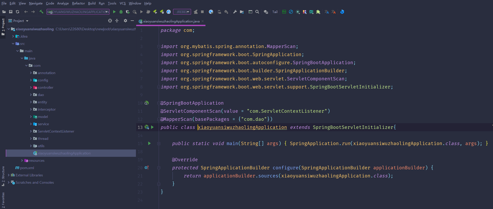

数据库表

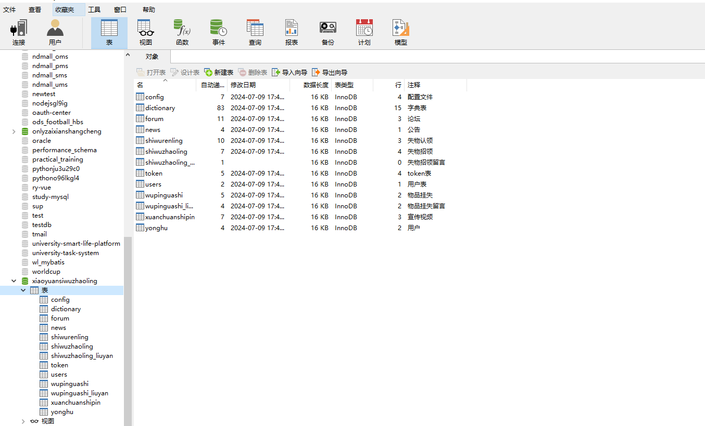

登录

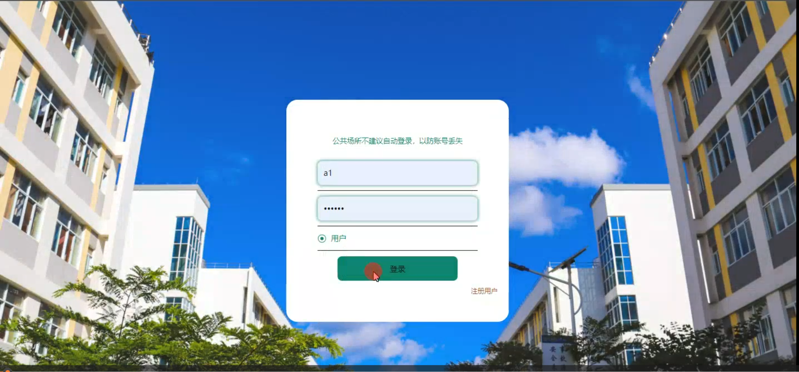

前台页面首页

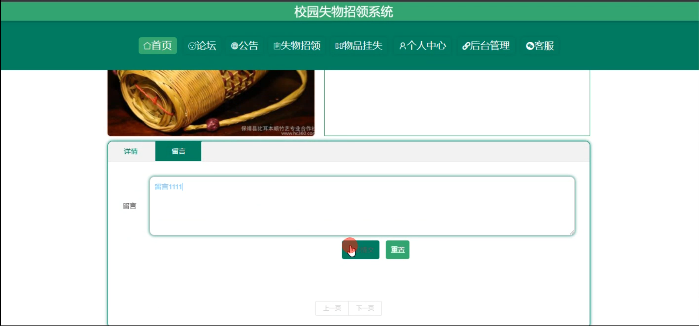

失物招领

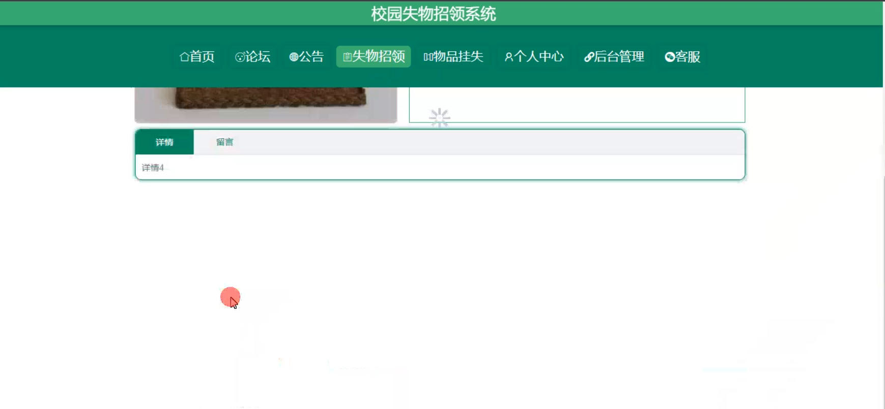

用户端后台管理

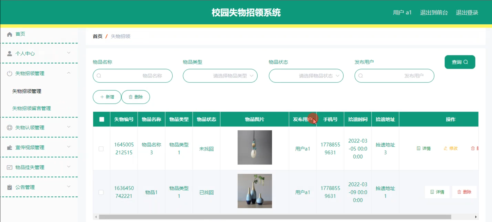

失物认领管理

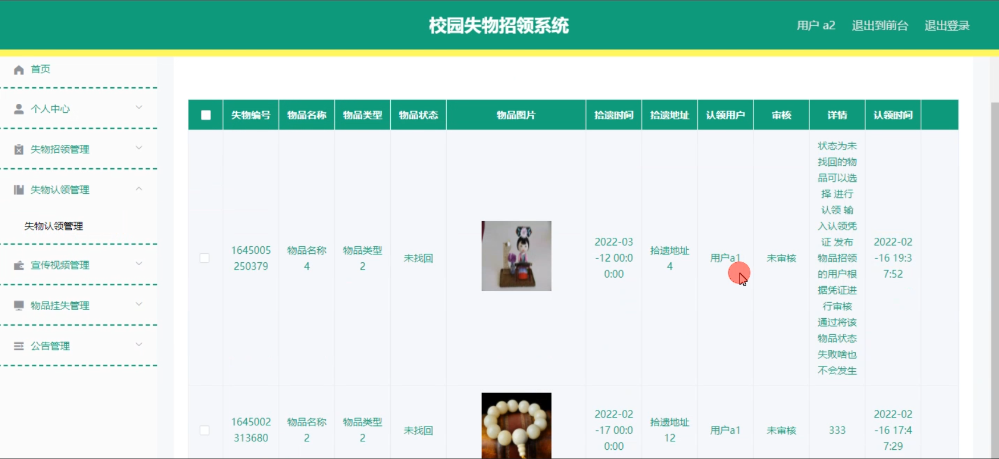

管理员端用户管理

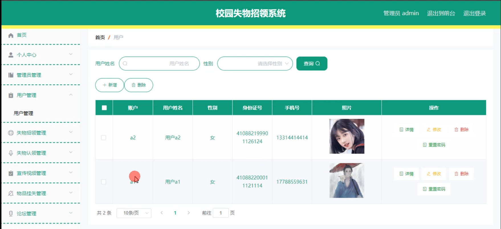

宣传视频管理

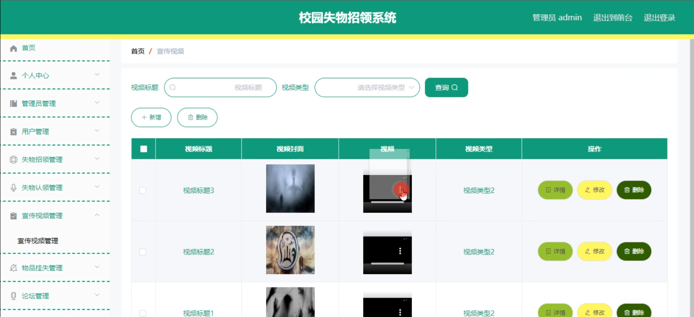

物品挂失留言管理

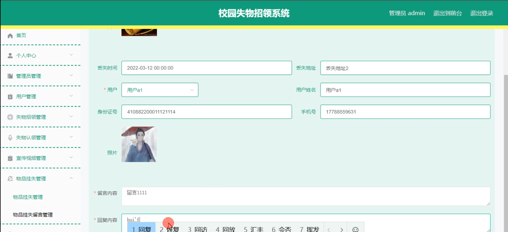

论坛

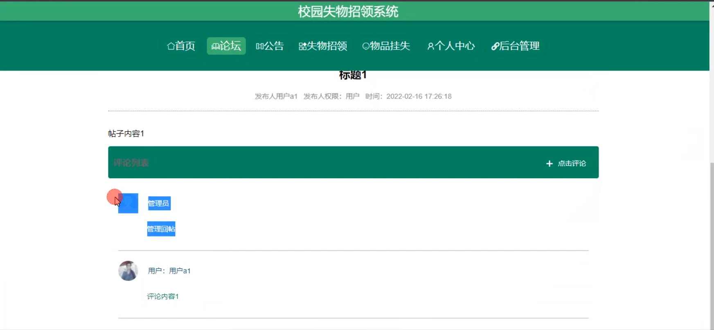

宣传视频

个人中心

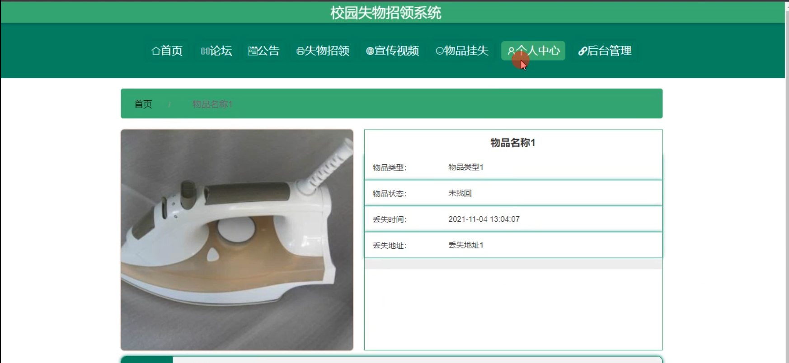

基础数据管理

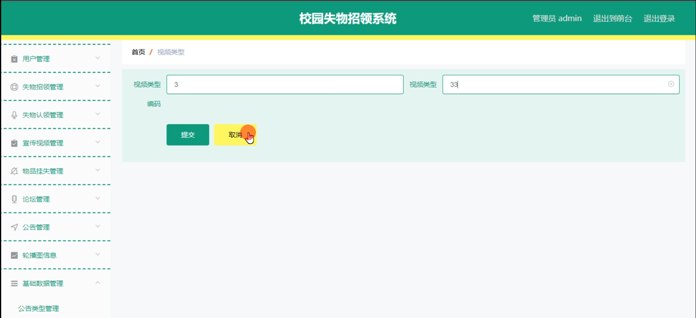

#### 总结

基于 Spring Boot 的校园失物招领系统通过明确的角色分工和丰富的功能模块，为校园内的失物招领工作带来了全新的管理模式和服务体验。管理员能够有效地管理和监督系统的运行，保障信息的准确性和安全性；用户能够便捷地发布和获取失物信息，参与互动交流。该系统有助于解决校园内失物招领的难题，提升校园的管理效率和文明程度，为师生创造更加便捷、和谐的校园生活环境。

#### 使用说明

创建数据库，执行数据库脚本 修改jdbc数据库连接参数 下载安装maven依赖jar 启动idea中的springboot项目

前台登录页面
http://localhost:8080/xiaoyuansiwuzhaoling/front/index.html

后台登录页面
http://localhost:8080/xiaoyuansiwuzhaoling/admin/dist/index.html

管理员			账户:admin 	密码：admin
用户				账户:a1 		密码：123456
用户				账户:a2 		密码：123456
用户				账户:a3 		密码：123456